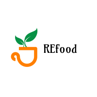

**REfood** is an innovative Rails web app, creating a virtual marketplace for purchasing food items close to their best before date.

The mission? To reduce food waste while providing you with a seamless and enjoyable shopping experience.

👨‍💻 **Behind the Scenes**:
This project was brought to life by a passionate team of four in a month-long effort, which I had the pleasure of leading during an exhilarating six-month journey at Le Wagon coding bootcamp.

🎥 **See Us in Action**:
You can catch a glimpse of REfood in action and see me demo it together with Federico here: [Watch Now](https://www.youtube.com/watch?v=egD6adtwXCY&t=617s) 

